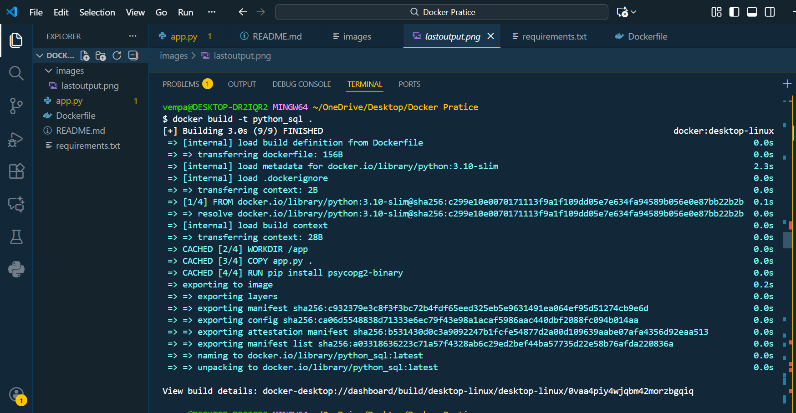
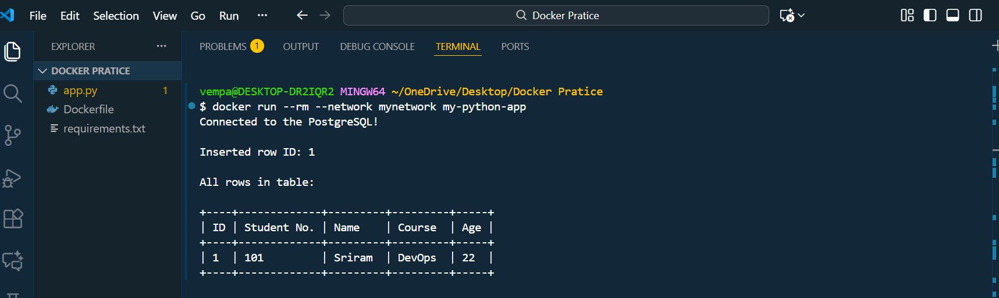
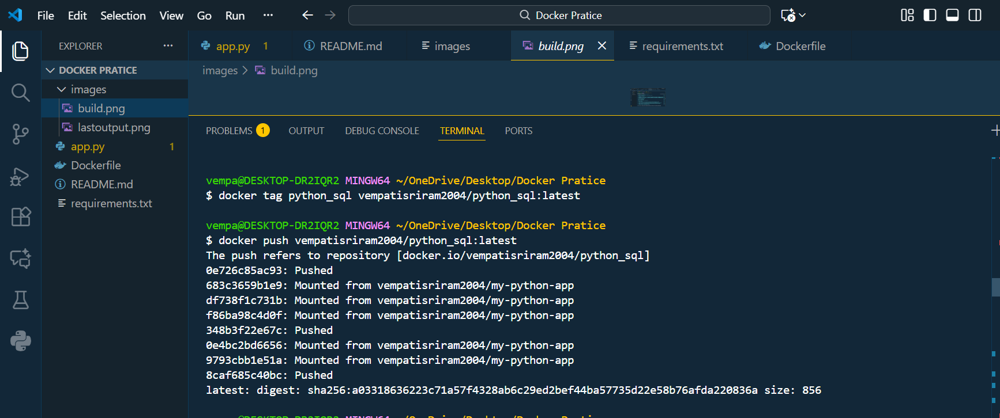

# Dockerized Python + PostgreSQL Mini Project

This project demonstrates how to use Docker to run a Python application that connects to a PostgreSQL database.

The app:

1. Connects to PostgreSQL

2. Creates a table

3. Inserts one row

4. Reads and displays the row in a formatted output

This is a perfect beginner-friendly introduction to Docker networking, Python containers, and database connectivity.

# Features

• Containerized Python application

• PostgreSQL database running in Docker

• Automatic table creation

• Automatic row insertion

• Clean, formatted table output

• Lightweight and reproducible environment

• Image push capability to Docker Hub

# project Structure 
```text

Docker-Practice/
│── app.py
│── Dockerfile
│── requirements.txt
│── README.md

```

# Step 1: Create Docker Network
```text
   docker network create mynetwork
```

# Step 2: docker network create mynetwork
```text
docker run -d \
  --name my-postgres \
  --network mynetwork \
  -e POSTGRES_USER=user \
  -e POSTGRES_PASSWORD=pass \
  -e POSTGRES_DB=mydb \
  -p 5432:5432 \
  postgres
```

# Step 3: Build the Python App Image
  ```text
    docker build -t python_sql .
```




# Step 4: Run the Python App Container
```text
    docker run --rm --network mynetwork python_sql
```

# Expected Output :



# Step 5: Push Image to Docker Hub

```text
    docker login
    docker tag my-python-app vempatisriram2004/python_sql:latest
    docker push vempatisriram2004/python_sql:latest
```



# Step 6: Pull Image From Docker Hub
  ```text   
    docker pull vempatisriram2004/python_sql:latest
```
# Technologies Used

• python

• Docker

• PostgreSQL

• psycopg2

• Docker Hub

# Author
```
Name: Vempati Sriram

GitHub: https://github.com/vempatisriram6-dev

```
